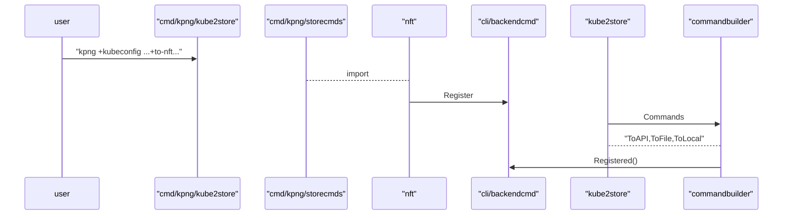

# Kubernetes Proxy NG

The Kubernetes Proxy NG a new design of kube-proxy aimed at

- allowing Kubernetes business logic to evolve with minimal to no impact on backend implementations,
- improving scalability,
- improving the ability of integrate 3rd party environments,
- being library-oriented to allow packaging logic at distributor's will,
- provide gRPC endpoints for lean integration, extensibility and observability.

The project will provide multiple components, with the core being the API watcher that will serve the global and node-specific sets of objects.

- More context can be found in the project's [KEP](https://github.com/kubernetes/enhancements/issues/2104).

# Meetings
## Americas
- The meeting agenda and [notes are here](https://docs.google.com/document/d/1yW3AUp5rYDLYCAtZc6e4zeLbP5HPLXdvuEFeVESOTic/edit#)
- See you friday at 8:30 PST / 11:30 EST !!!  
- [Convert to your timezone](https://dateful.com/convert/pst-pdt-pacific-time?t=830am&tz2=EST-EDT-Eastern-Time)  

## APAC
- Every Wednesday at 7:00PM IST / 8:30 EST [zoom link here](https://zoom.us/j/94435779760?pwd=TnJvdDRURktDVTZENU1kQXd5RlFBdz09).  
- [Convert to your timezone](https://dateful.com/convert/indian-standard-time-ist?t=7pm)

## How we work

The KPNG group is small but dedicated, because this is a hard project.  Your first commit might take weeks or months, especially if you're new
to the kube-proxy or to K8s networking.  However, we will pair with people wanting to join and make an impact.  We pair program every friday
at our meetings, and also, informally at other times as well.  

Our goal is to: 
- make the kube proxy fun to work on and easy to understand
- make the kube proxy extensible from a command line and backend perspective
- learn as much as we can about k8s service networking, and build an upstream community around it

And that goes for people working on KPNG especially.  So don't hesitate to join us, but just be ready for alot of work and low level troubleshooting.

## KPNG News

- ... (please MR updates here)
- 10/15/2021: KPNG got a shoutout at the sig-network kubecon update :) thanks @bowie 
- 10/7/2021: Userspace kube proxy port nearing completion
- 10/1/2021: Separating KPNG backends from other code so it's easy to import

## Community, discussion, contribution, and support

Learn how to engage with the Kubernetes community on the [community page](http://kubernetes.io/community/).

You can reach the maintainers of this project at: 

- [Meeting info](https://docs.google.com/document/d/1yW3AUp5rYDLYCAtZc6e4zeLbP5HPLXdvuEFeVESOTic)
- [Slack](http://slack.k8s.io/) , Join the #sig-net-kpng channel !
- [Mailing List](https://groups.google.com/forum/#!forum/kubernetes-dev)

### Code of conduct

Participation in the Kubernetes community is governed by the [Kubernetes Code of Conduct](code-of-conduct.md).

[owners]: https://git.k8s.io/community/contributors/guide/owners.md
[Creative Commons 4.0]: https://git.k8s.io/website/LICENSE


TODO add some lines about what to find ./hack

### Code walkthrough

#### The KPNG kube ... command path
We start by looking at the typical KPNG invocation, where we watch the Kubernetes API Server and forward it's events down to an NFT proxy backend on all nodes. 

The below command would run, generally, in a daemonset:
```go
kube --kubeconfig=/var/lib/kpng/kubeconfig.conf to-local to-nft
```

- `kpng` is the kpng binary.
- `kube` is the command which kpng runs, which watches and internalizes the Kubernetes network API (services and pods)
- `to-local` is a cobra command, which proxies to a "local" backend (like, NFT).
- `to-nft` is the name of the local backend, and is a **subcommand** of `to-local`. 

Thus, KPNG uses a core command "kube" to start up, and then decides wether it is going to write iptables/nft/ebpf... rule
based on the value of the subcommands for the `to-local` option which it recieves.

The way that the *to-nft* subcommand is built up at runtime, when KPNG introspects and imports several pacages.

- On startup, before parsing arguments, KPNG imports several *backend* packages
- these imports result in `init()` functions being called,
- the `init()` functions in those backends then calls out to the `Register()` function in the `backendcmd` pacakge.
```go
    // scorecmds_linux.go calls the `init()` functions in all the following packages... 
    import (
    _ "sigs.k8s.io/kpng/backends/ebpf"
    _ "sigs.k8s.io/kpng/backends/iptables"
    _ "sigs.k8s.io/kpng/backends/ipvs-as-sink"
    _ "sigs.k8s.io/kpng/backends/nft"
    _ "sigs.k8s.io/kpng/backends/userspacelin"
    )
```
- Using the **cobra** API, KPNG now reads through the `Registered()` backends (which are called above), and makes command line options for these one at a time.  The logic for this
is in the `ToLocalCmd(...)` function, 
  - ToLocal: Connecting the changes in the k8s networking statespace to a backend, that implements the KPNG sink interface, which we'll go over next.


In the code, the way that these subcommands are built up, is as follows:



At this point, you now have KPNG watching the Kubernetes APIServer, and writing out new backend rules for every new service or pod that is created.

Since the command line invocation above specifies 2 things:
- Watch the kubernetes API Server
- Send its events, decoded as KPNG objects to the NFT backend which will write routing rules

We will now go through these 2 separate KPNG process which were just started.

#### The "Kube" or "Kube2Store" command

The Kube command is self explanatory.  It isnt dependent on any way, of the underlying backend (or lack thereof).  

#### The "to-local to-nft" command

TODO (will add this later)