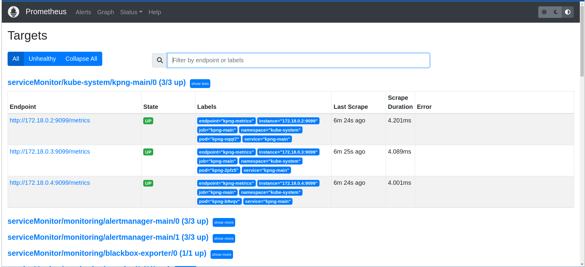
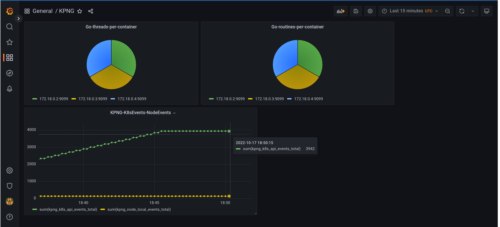

# KPNG Metrics

KPNG has the ability to export custom prometheus metrics described in
`/server/pkg/metrics`.

The `--exportMetrics <IP>:<PORT>` flag allows the user to configure the endpoint of the
metrics server started by KPNG.

Currently there are two specific KPNG defined metrics:

```go
var Kpng_k8s_api_events = prometheus.NewCounter(prometheus.CounterOpts{
	Name: "kpng_k8s_api_events_total",
	Help: "The total number of received events from the Kubernetes API",
})

var Kpng_node_local_events = prometheus.NewCounter(prometheus.CounterOpts{
	Name: "kpng_node_local_events_total",
	Help: "The total number of received events from the Kubernetes API for a given node",
})
```

Which can be plotted to show significant event reduction effect KPNG provides for
backends.

When running kpng you can manually query those endpoints to ensure the metrics
server is up and running. It will dump our custom KPNG metrics along with some
built-in golang ones.

```
root@kpng-e2e-ipv4-nft-control-plane:/# curl 0.0.0.0:9090/metrics
...
# HELP go_threads Number of OS threads created.
# TYPE go_threads gauge
go_threads 16
# HELP kpng_k8s_api_events_total The total number of received events from the Kubernetes API
# TYPE kpng_k8s_api_events_total counter
kpng_k8s_api_events_total 38
# HELP process_cpu_seconds_total Total user and system CPU time spent in seconds.
# TYPE process_cpu_seconds_total counter
process_cpu_seconds_total 0.09
# HELP process_max_fds Maximum number of open file descriptors.
# TYPE process_max_fds gauge
process_max_fds 1.073741816e+09
# HELP process_open_fds Number of open file descriptors.
# TYPE process_open_fds gauge
process_open_fds 12
# HELP process_resident_memory_bytes Resident memory size in bytes.
# TYPE process_resident_memory_bytes gauge
process_resident_memory_bytes 3.5057664e+07
# HELP process_start_time_seconds Start time of the process since unix epoch in seconds.
# TYPE process_start_time_seconds gauge
process_start_time_seconds 1.66602840299e+09
# HELP process_virtual_memory_bytes Virtual memory size in bytes.
# TYPE process_virtual_memory_bytes gauge
process_virtual_memory_bytes 7.73316608e+08
# HELP process_virtual_memory_max_bytes Maximum amount of virtual memory available in bytes.
# TYPE process_virtual_memory_max_bytes gauge
process_virtual_memory_max_bytes 1.8446744073709552e+19
# HELP promhttp_metric_handler_requests_in_flight Current number of scrapes being served.
# TYPE promhttp_metric_handler_requests_in_flight gauge
promhttp_metric_handler_requests_in_flight 1
# HELP promhttp_metric_handler_requests_total Total number of scrapes by HTTP status code.
# TYPE promhttp_metric_handler_requests_total counter
promhttp_metric_handler_requests_total{code="200"} 0
promhttp_metric_handler_requests_total{code="500"} 0
promhttp_metric_handler_requests_total{code="503"} 0
```

## Deploying Prometheus-operator and Graphana

To actually scrape and graph these metrics from KPNG running in a live kubernetes
cluster we can use the [prometheus-operator](https://prometheus-operator.dev/) and [Graphana](https://grafana.com/).

### Step 1

Deploy a Kind cluster with KPNG and metrics enabled, this should work for any
backend but a good one to start with is `nft`.

```bash
./hack/test_e2e.sh -i ipv4 -b nft -d -M
```

### Step 2

Clone kube-prometheus to your local machine:

```bash
git clone https://github.com/prometheus-operator/kube-prometheus.git && cd kube-prometheus
```

Create the monitoring stack using the config in the manifests directory:

```bash
# Create the namespace and CRDs, and then wait for them to be available before creating the remaining resources
# Note that due to some CRD size we are using kubectl server-side apply feature which is generally available since kubernetes 1.22.
# If you are using previous kubernetes versions this feature may not be available and you would need to use kubectl create instead.
kubectl apply --server-side -f manifests/setup
kubectl wait \
	--for condition=Established \
	--all CustomResourceDefinition \
	--namespace=monitoring
kubectl apply -f manifests/
```

Then wait until all pods are up and running in the `monitoring` namespace:

```bash
kubectl get pods -n monitoring 
NAMESPACE            NAME                                                      READY   STATUS    RESTARTS   AGE
monitoring           alertmanager-main-0                                       2/2     Running   0          105s
monitoring           alertmanager-main-1                                       2/2     Running   0          105s
monitoring           alertmanager-main-2                                       2/2     Running   0          105s
monitoring           blackbox-exporter-59cccb5797-gzgcq                        3/3     Running   0          114s
monitoring           grafana-67b774cb88-jgkjg                                  1/1     Running   0          113s
monitoring           kube-state-metrics-648ff47fd6-4vr2x                       3/3     Running   0          113s
monitoring           node-exporter-7mdc5                                       2/2     Running   0          113s
monitoring           node-exporter-8w765                                       2/2     Running   0          113s
monitoring           node-exporter-jwql8                                       2/2     Running   0          113s
monitoring           prometheus-adapter-757f9b4cf9-l5d6z                       1/1     Running   0          113s
monitoring           prometheus-adapter-757f9b4cf9-qxz6h                       1/1     Running   0          113s
monitoring           prometheus-k8s-0                                          2/2     Running   0          103s
monitoring           prometheus-k8s-1                                          2/2     Running   0          103s
monitoring           prometheus-operator-5c8bd94f8c-5tqn8                      2/2     Running   0          112s
```

### Step 3

Use `kubectl` + portforwarding to access prometheus + grafana dashboards:

prometheus:

```bash
kubectl --namespace monitoring port-forward svc/prometheus-k8s 9091:9090 --address='0.0.0.0'
```

grafana:

```bash
kubectl --namespace monitoring port-forward svc/grafana 3000 --address='0.0.0.0'
```

Now you can access both dashboards using their respective endpoints in any browser.

### Step 4

Apply custom service/service monitor which allows prometheus to scrap the KPNG
specific metrics.

```bash
kubectl apply -f hack/kpng-service-monitor.yaml
```

Now you should see the KPNG metric endpoint(s) (one for each node) on the prometheus dashboard:



### Step 5

Upload the KPNG Dashboard (`hack/KPNG-Dashboard.json`) in the [grafana dashboard GUI](https://grafana.com/docs/grafana/v9.0/dashboards/export-import/)
to see the KPNG specific metrics.



## TODO

Feel free to add more metrics/update the built in grafana dashboard :)